# Firefly OpenCore Banking Platform - Customer Management Core Module

[](https://github.com/firefly-oss/core-common-customer-mgmt)
[](LICENSE)
[](pom.xml)

## Overview

The **Firefly OpenCore Banking Platform - Customer Management Core Module** is a comprehensive, reactive microservice designed for managing customer data in modern banking and financial services platforms. Built with Spring WebFlux and reactive programming principles, this module provides a complete solution for handling both individual (Natural Person) and corporate (Legal Entity) customers with full compliance capabilities.

### Key Features

- **Reactive Architecture**: Built on Spring WebFlux for non-blocking, scalable operations
- **Comprehensive Customer Management**: Support for both individual and corporate customers
- **Regulatory Compliance**: Built-in GDPR consent management and PEP (Politically Exposed Person) tracking
- **Multi-dimensional Relationships**: Complex party-to-party relationship modeling
- **Contact Management**: Multi-channel contact information with verification capabilities
- **Document Management**: Identity document handling and storage
- **Geographic Support**: Address management with geo-location capabilities
- **RESTful API**: Complete OpenAPI 3.0 documented REST endpoints
- **Multi-module Architecture**: Clean separation of concerns across 5 modules

## Architecture

### Module Structure

```
core-common-customer-mgmt/
├── core-common-customer-mgmt-core/       # Business logic and services
├── core-common-customer-mgmt-interfaces/ # Enums and interface definitions
├── core-common-customer-mgmt-models/     # R2DBC entities and data models
├── core-common-customer-mgmt-sdk/        # Client SDK for integration
└── core-common-customer-mgmt-web/        # REST controllers and web layer
```

### Technology Stack

- **Framework**: Spring Boot 3.x with Spring WebFlux
- **Database**: PostgreSQL with Spring Data R2DBC
- **Build Tool**: Maven 3.x
- **Documentation**: OpenAPI 3.0 / Swagger
- **Testing**: JUnit 5, Mockito
- **Code Quality**: Lombok for boilerplate reduction

## Entity Relationship Diagram

The following diagram illustrates the complete data model and relationships between all entities in the system:

**Note on Foreign Keys vs Logical References:**
- Fields marked as `FK` have actual database foreign key constraints enforced by PostgreSQL
- Fields without `FK` marking (but with `uuid` type ending in `_id`) are logical references only - they reference other entities conceptually but without database constraints
- This design provides flexibility for referencing external systems (countries, document types, etc.) that may not have corresponding tables in this database

```mermaid
erDiagram
    PARTY {
        uuid party_id PK
        varchar party_kind "NATURAL_PERSON | LEGAL_ENTITY"
        uuid tenant_id "Firefly core banking deployment tenant identifier"
        varchar preferred_language
        varchar source_system
        timestamp created_at
        timestamp updated_at
    }

    NATURAL_PERSON {
        uuid natural_person_id PK
        uuid party_id FK
        varchar title
        varchar given_name
        varchar middle_name
        varchar family_name1
        varchar family_name2
        date date_of_birth
        varchar birth_place
        uuid birth_country_id
        uuid nationality_country_id
        varchar gender "MALE | FEMALE | OTHER"
        varchar marital_status "SINGLE | MARRIED | DIVORCED | WIDOWED | SEPARATED"
        varchar tax_id_number
        varchar residency_status "RESIDENT | NON_RESIDENT | TEMPORARY_RESIDENT"
        varchar occupation
        decimal monthly_income
        varchar suffix
        timestamp created_at
        timestamp updated_at
    }
    
    LEGAL_ENTITY {
        uuid legal_entity_id PK
        uuid party_id FK
        varchar legal_name
        varchar trade_name
        varchar registration_number
        varchar tax_id_number
        uuid legal_form_id
        date incorporation_date
        varchar industry_description
        bigint headcount
        decimal share_capital
        varchar website_url
        uuid incorporation_country_id
        timestamp created_at
        timestamp updated_at
    }
    
    ADDRESS {
        uuid address_id PK
        uuid party_id FK
        varchar address_kind "HOME | WORK | BILLING | MAILING | OTHER"
        varchar line1
        varchar line2
        varchar city
        varchar region
        varchar postal_code
        uuid country_id
        boolean is_primary
        decimal latitude
        decimal longitude
        timestamp created_at
        timestamp updated_at
    }

    EMAIL_CONTACT {
        uuid email_contact_id PK
        uuid party_id FK
        varchar email
        varchar email_kind "PERSONAL | WORK | OTHER"
        boolean is_primary
        boolean is_verified
        timestamp created_at
        timestamp updated_at
    }

    PHONE_CONTACT {
        uuid phone_contact_id PK
        uuid party_id FK
        varchar phone_number
        varchar phone_kind "MOBILE | HOME | WORK | FAX | OTHER"
        varchar extension
        boolean is_primary
        boolean is_verified
        timestamp created_at
        timestamp updated_at
    }
    
    IDENTITY_DOCUMENT {
        uuid identity_document_id PK
        uuid party_id FK
        uuid identity_document_category_id
        uuid identity_document_type_id
        varchar document_number
        uuid issuing_country_id
        timestamp issue_date
        timestamp expiry_date
        varchar issuing_authority
        boolean validated
        varchar document_uri
        timestamp created_at
        timestamp updated_at
    }

    CONSENT {
        uuid consent_id PK
        uuid party_id FK
        uuid consent_type_id
        boolean granted
        timestamp granted_at
        timestamp revoked_at
        varchar channel
        timestamp created_at
        timestamp updated_at
    }
    
    PARTY_RELATIONSHIP {
        uuid party_relationship_id PK
        uuid from_party_id FK
        uuid to_party_id FK
        uuid relationship_type_id
        timestamp start_date
        timestamp end_date
        boolean active
        text notes
        timestamp created_at
        timestamp updated_at
    }

    PARTY_STATUS {
        uuid party_status_id PK
        uuid party_id FK
        varchar status_type "ACTIVE | INACTIVE | SUSPENDED | BLOCKED | PENDING"
        varchar reason
        timestamp effective_date
        timestamp expiry_date
        varchar set_by_user
        text comments
        timestamp created_at
        timestamp updated_at
    }
    
    PARTY_ECONOMIC_ACTIVITY {
        uuid party_economic_activity_id PK
        uuid party_id FK
        uuid economic_activity_id
        decimal annual_turnover
        varchar currency_code
        timestamp start_date
        timestamp end_date
        boolean is_primary
        timestamp created_at
        timestamp updated_at
    }

    PARTY_PROVIDER {
        uuid party_provider_id PK
        uuid party_id FK
        varchar provider_name
        varchar external_reference
        varchar provider_status "ACTIVE | INACTIVE | SUSPENDED"
        timestamp last_sync_at
        timestamp created_at
        timestamp updated_at
    }

    POLITICALLY_EXPOSED_PERSON {
        uuid pep_id PK
        uuid party_id FK
        boolean pep
        varchar category
        varchar public_position
        uuid country_of_position_id
        timestamp start_date
        timestamp end_date
        varchar notes
        timestamp created_at
        timestamp updated_at
    }

    %% Relationships
    PARTY ||--o| NATURAL_PERSON : "is a"
    PARTY ||--o| LEGAL_ENTITY : "is a"
    PARTY ||--o{ ADDRESS : "has"
    PARTY ||--o{ EMAIL_CONTACT : "has"
    PARTY ||--o{ PHONE_CONTACT : "has"
    PARTY ||--o{ IDENTITY_DOCUMENT : "has"
    PARTY ||--o{ CONSENT : "gives"
    PARTY ||--o{ PARTY_STATUS : "has"
    PARTY ||--o{ PARTY_ECONOMIC_ACTIVITY : "performs"
    PARTY ||--o{ PARTY_PROVIDER : "relates to"
    PARTY ||--o| POLITICALLY_EXPOSED_PERSON : "may be"
    
    PARTY ||--o{ PARTY_RELATIONSHIP : "from"
    PARTY ||--o{ PARTY_RELATIONSHIP : "to"
```



### Entity Descriptions

#### Core Entities

- **Party**: The supertype entity representing any customer (individual or corporate)
- **Natural Person**: Individual customers with personal information, demographics, and financial data
- **Legal Entity**: Corporate customers with business registration, incorporation details, and company metrics

#### Contact & Address Entities

- **Address**: Physical addresses with geo-location support and multiple address types
- **Email Contact**: Email addresses with verification status and categorization
- **Phone Contact**: Phone numbers with extensions and verification status

#### Document & Compliance Entities

- **Identity Document**: Government-issued identification documents with verification tracking
- **Consent**: GDPR-compliant consent management for data processing and marketing
- **Politically Exposed Person**: Regulatory compliance for PEP identification and risk assessment

#### Relationship & Status Entities

- **Party Relationship**: Many-to-many relationships between parties with temporal data
- **Party Status**: Status tracking with reasons and effective dates
- **Party Economic Activity**: Employment and business activity information
- **Party Provider**: Relationships with other financial service providers

## API Structure

### RESTful Endpoints

All API endpoints follow RESTful conventions and start with `/api/v1`. The system uses reactive programming with `Mono<ResponseEntity<T>>` return types.

#### Main Resources

- **Parties**: `/api/v1/parties` - Core customer management
- **Natural Persons**: `/api/v1/parties/{partyId}/natural-persons` - Individual customer details  
- **Legal Entities**: `/api/v1/parties/{partyId}/legal-entities` - Corporate customer details

#### Contact Management

- **Addresses**: `/api/v1/parties/{partyId}/addresses` - Physical address management
- **Email Contacts**: `/api/v1/parties/{partyId}/contacts/email` - Email address management
- **Phone Contacts**: `/api/v1/parties/{partyId}/contacts/phone` - Phone number management

#### Document & Compliance

- **Identity Documents**: `/api/v1/parties/{partyId}/documents/identity` - Document management
- **Consents**: `/api/v1/parties/{partyId}/consents` - Privacy consent management
- **PEP Records**: `/api/v1/politically-exposed-persons` - Regulatory compliance

#### Relationships

- **Party Relationships**: `/api/v1/parties/{partyId}/relationships` - Inter-party relationships

### API Features

- **OpenAPI 3.0 Documentation**: Complete Swagger documentation
- **Reactive Programming**: Non-blocking I/O with Spring WebFlux
- **Validation**: Jakarta Bean Validation with comprehensive error handling
- **Pagination**: Built-in pagination support for list operations
- **Filtering**: Advanced filtering capabilities with FilterRequest pattern

## Getting Started

### Prerequisites

- Java 17 or later
- Maven 3.8 or later
- PostgreSQL 13 or later
- Docker (optional, for containerized deployment)

### Installation

1. **Clone the repository**
   ```bash
   git clone https://github.com/firefly-oss/core-common-customer-mgmt.git
   cd core-common-customer-mgmt
   ```

2. **Build the project**
   ```bash
   mvn clean compile
   ```

3. **Run tests**
   ```bash
   mvn test
   ```

4. **Package the application**
   ```bash
   mvn clean package
   ```

### Configuration

#### Database Configuration

Configure PostgreSQL connection in `application.yml`:

```yaml
spring:
  r2dbc:
    url: r2dbc:postgresql://localhost:5432/customer_mgmt
    username: your_username
    password: your_password
    pool:
      initial-size: 10
      max-size: 50
```

#### Application Properties

```yaml
server:
  port: 8080
  
management:
  endpoints:
    web:
      exposure:
        include: health,info,metrics
        
springdoc:
  api-docs:
    enabled: true
  swagger-ui:
    enabled: true
    path: /swagger-ui.html
```

### Running the Application

#### Development Mode

```bash
mvn spring-boot:run -pl core-common-customer-mgmt-web
```

#### Production Mode

```bash
java -jar core-common-customer-mgmt-web/target/core-common-customer-mgmt-web-1.0.0-SNAPSHOT.jar
```

#### Docker Deployment

```bash
# Build Docker image
docker build -t firefly-customer-mgmt .

# Run container
docker run -p 8080:8080 -e DATABASE_URL=postgresql://localhost:5432/customer_mgmt firefly-customer-mgmt
```

### API Documentation

Once the application is running, access the interactive API documentation at:

- **Swagger UI**: http://localhost:8080/swagger-ui.html
- **OpenAPI Spec**: http://localhost:8080/v3/api-docs

## Development

### Project Structure

```
src/
├── main/java/com/firefly/core/customer/
│   ├── core/           # Business logic and services
│   ├── interfaces/     # Enums and interfaces
│   ├── models/         # Entity definitions
│   ├── sdk/           # Client SDK
│   └── web/           # REST controllers
└── test/java/         # Unit and integration tests
```

### Code Quality

- **Lombok**: Used for reducing boilerplate code
- **Validation**: Jakarta Bean Validation annotations
- **Testing**: Comprehensive unit tests with JUnit 5 and Mockito
- **Documentation**: JavaDoc for all public APIs

### Contributing

1. Fork the repository
2. Create a feature branch (`git checkout -b feature/amazing-feature`)
3. Commit your changes (`git commit -m 'Add amazing feature'`)
4. Push to the branch (`git push origin feature/amazing-feature`)
5. Open a Pull Request

### Testing Strategy

```bash
# Unit tests
mvn test

# Integration tests
mvn verify

# Test coverage report
mvn jacoco:report
```

## Deployment

### Environment-Specific Configuration

#### Development
```yaml
spring:
  profiles:
    active: dev
  r2dbc:
    url: r2dbc:postgresql://localhost:5432/customer_mgmt_dev
```

#### Staging
```yaml
spring:
  profiles:
    active: staging
  r2dbc:
    url: r2dbc:postgresql://staging-db:5432/customer_mgmt
```

#### Production
```yaml
spring:
  profiles:
    active: prod
  r2dbc:
    url: r2dbc:postgresql://prod-db:5432/customer_mgmt
```

### Monitoring & Observability

- **Health Checks**: `/actuator/health`
- **Metrics**: `/actuator/metrics`
- **Info**: `/actuator/info`

## Security

### Data Protection

- **GDPR Compliance**: Built-in consent management
- **Data Encryption**: Sensitive data encryption at rest
- **Access Control**: Role-based access control (RBAC)
- **Audit Trail**: Comprehensive audit logging

### API Security

- **Authentication**: OAuth 2.0 / JWT support
- **Authorization**: Method-level security
- **Rate Limiting**: API rate limiting capabilities
- **Input Validation**: Comprehensive input validation

## Performance

### Reactive Architecture Benefits

- **Non-blocking I/O**: Improved throughput and resource utilization
- **Backpressure Support**: Handling of varying load conditions
- **Scalability**: Horizontal scaling capabilities
- **Resource Efficiency**: Lower memory and thread usage

### Database Optimization

- **Connection Pooling**: R2DBC connection pool configuration
- **Query Optimization**: Efficient query patterns
- **Indexing Strategy**: Optimized database indexes
- **Caching**: Strategic caching implementation

## Support

### Community

- **Issues**: [GitHub Issues](https://github.com/firefly-oss/core-common-customer-mgmt/issues)
- **Discussions**: [GitHub Discussions](https://github.com/firefly-oss/core-common-customer-mgmt/discussions)
- **Team**: Firefly Team

### Commercial Support

For enterprise support and consulting services, contact the Firefly Team.

## License

This project is licensed under the Apache 2.0 License - see the [LICENSE](LICENSE) file for details.

## Acknowledgments

- **Firefly Team** - Core development and architecture
- **Spring Team** - For the excellent reactive framework
- **PostgreSQL Community** - For the robust database platform

---

**Firefly OpenCore Banking Platform** - Empowering the next generation of financial services.